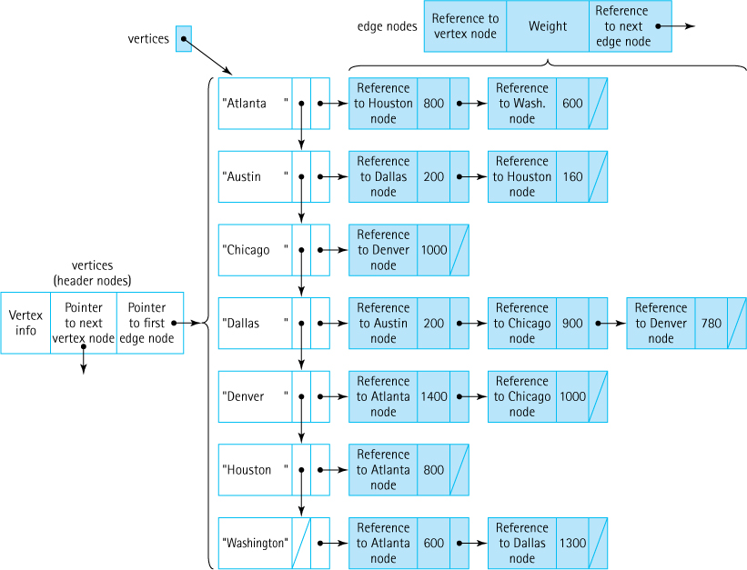

# CSMC-350 Project Four

## Description

The fourth programming project involves writing a program that accepts information contained in a file about
the class dependencies in a Java program and creates a directed graph from that information. From the directed
graph, it produces two different kinds of displays of those dependency relationships.

A sample input file is shown below:

```text
ClassA ClassC ClassE ClassJ
ClassB ClassD ClassG
ClassC ClassA 
ClassE ClassB ClassF ClassH 
ClassJ ClassB 
ClassI ClassC
```

The first name of each line of the file is  a Java class upon which other classes depend. The remaining names are
the classes that depend upon the first class on that line. The first line of the above file, for example, indicated
that `ClassA` has three classes that depend upon it, `ClassC, ClassE` and `ClassJ`. A class that does not have any
classes which depend upon it need not appear at the head of any line.

## Main Class

The main method in the class for this project should allow the user to select the input file from the default directory
by using the `JFileChooser` class. It should then add the edges to a directed graph that defines these class 
dependencies.

The main method should produce both representations `ParenthesizedList` and `Hierarchy`. In addition, it should display
the unreachable classes by calling the `ParenthesizedList` method. For the input file, the following unreachable class
should be identified - `ClassI is unreachable`

## Directed Graph Class

This should be a generic class, whose generic parameter specifies the type of the labels that are associated with the 
<u>vertices of the graph</u>. The internal representation of the graph should be the <u>alternate adjacency list
representation illustrated in Figure 10.7 of our textbook</u>. Unlike that graph, however, this graph will not be a 
weighted graph.

It should contain a method that allows edges to be added to the graph, which is how the main method will initially 
build the graph. It should also contain a method that performs a depth-first search of the graph. The pseudocode 
for that search is shown below:

```text
depth_first_search(vertex s)
    if s is discovered
        perform cycle detected action
        return
    perform add vertex action
    mark s as discovered
    perform descend action
    for all adjacent vertices v
        dept_first_search(v)
    perform ascend action
    mark s as finished 
```

When the method in the `DirecetedGraph` class, `(depth_first_search) or whatever you name it`, that initiates the depth
first search is called, it should first initialize all the vertices to the undiscovered state and begin the search at
the vertex that corresponds to the first name in the input file.

- Initialize all the state and start with first class in input file

Another method in the `DirectedGraph` class should then allow the `main method` to display any unreachable classes by
examining all the vertices of the graph to see which remain undiscovered.

### Alternate Adjacency List Image 



## DFSActions Interface

This project should contain a generic interface whose generic parameter again specifies the type of the labels that are
associated with the vertices of the graph. It should contain four method signatures that correspond to the four actions
performed in the depth first search:

    - cycle detected
    - process vertex
    - descend 
    - ascend

## Hierarchy Class Implements DFSActions Interface

    - Produces a hierarchical representation of the class dependencies 
    - Circular dependencies should be flagged

For the input file below: [<b><u>SAME AS ABOVE</u></b>]

```text
ClassA ClassC ClassE ClassJ
ClassB ClassD ClassG
ClassC ClassA 
ClassE ClassB ClassF ClassH 
ClassJ ClassB 
ClassI ClassC
```

The following hierarchical representation should be produced:

```text
ClassA 
    ClassC * 
    ClassE 
        ClassB 
            ClassD 
            ClassG 
        ClassF 
        ClassH 
    ClassJ 
        ClassB 
            ClassD 
            ClassG
```

The asterisk after `ClassC` results from the fact that `ClassC` depends upon `ClassA` and `ClassE` depends upon 
`ClassC`. The `Hierarchy` class should override the `toString` method, which should return a string that contains the 
above, after having performed the depth-first search. 

## ParenthesizedList Class Implements DFSActions Interface

    - This should produce an alternate representation that is also returned by its `toString` method
    - Should display any unreachable classes in it's ouput

For the input file below: [<b><u>SAME AS ABOVE</u></b>]

```text
ClassA ClassC ClassE ClassJ
ClassB ClassD ClassG
ClassC ClassA 
ClassE ClassB ClassF ClassH 
ClassJ ClassB 
ClassI ClassC
```

The following hierarchical representation should be produced:

```text
( ClassA ( ClassC * ClassE ( ClassB ( ClassD ClassG ) ClassF ClassH ) ClassJ ( ClassB ( ClassD ClassG ))))
```
